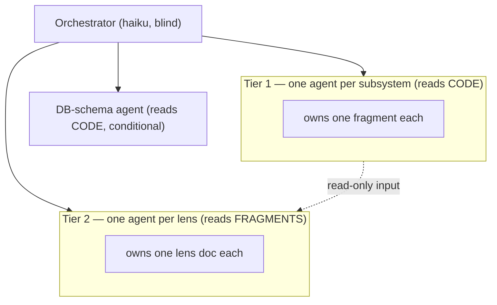

# codemap

Builds `codemap/`: a few **whole-system** documents, each viewing the entire codebase from one perspective. Reader browses these *instead of* the code, then drills into source. Output = **mental model** — concepts, flows, rules. No file listings, no method/class enumeration, no signatures.

## Rules

1. **Haiku only.** Skill and every subagent run on `haiku`. Pass `model: haiku` when spawning. No escalation.
2. **Blind orchestrator.** Never read source content or generated docs. Only: list paths, count lines, spawn subagents, run Step 4.5 diagram validator (read pass/fail + error text only), collect each subagent's one-line completion (path + count). No reading, auditing, editing, or stitching.
3. **One file, one owner.** Each output file written by exactly one subagent. Tier-2 lens agent may read tier-1 fragment files (read-only) but writes only its own file. No agent writes outside its owned file.
4. **Mermaid for all visuals. No ASCII.** Every diagram, tree, flow, or relationship graphic → fenced ```mermaid``` block. ASCII art / box-drawing / indented trees as visuals forbidden. Prose, lists, data tables fine. Every block must PARSE — see **Mermaid syntax contract** below; Step 4.5 gate enforces it.

## Mermaid syntax contract

Prepend this block **verbatim** to every subagent prompt (tier-1, DB, tier-2). Syntax half of "Mermaid for all visuals"; Step 4.5 mechanically enforces it by rendering each diagram.

> MERMAID — every ```mermaid``` block you emit MUST parse (it is rendered by
> mermaid-cli; a parse error fails the build). NO ASCII diagrams. Obey exactly:
> - **mindmap** — one root; node text is plain words. Do NOT put `( ) [ ] { }`
>   in node text — Mermaid reads them as node-shape delimiters and the line
>   breaks. Use `—`, `:`, or `,` instead (write `PDF via xelatex & DOCX`, not
>   `PDF (xelatex) & DOCX`).
> - **erDiagram** — each attribute row is `type name`, then optional key
>   `PK`/`FK`/`UK`, then optional `"comment"`. `type` and `name` are BARE tokens
>   (letters, digits, `_`); NEVER quote them. A quoted string is ONLY ever the
>   trailing comment: `int sales_units "units sold"`. Quoting the name —
>   `double_precision "f1_score"` — is the #1 parse failure; write
>   `double_precision f1_score`.
> - **labels** — every relationship/edge label is a quoted string:
>   `CUSTOMER ||--o{ ORDER : "places"` , `A -->|"per customer"| B`.
> - **flowchart** — if node text has spaces or any of `( ) [ ] { } | < > " &`,
>   wrap it in quotes inside the shape: `N["External → Redshift (ETL)"]`. Unicode
>   arrows/symbols (`→ & $`) are fine inside quoted labels or prose, never as
>   bare tokens in mindmap or er-attribute text.

## Topology



Outputs: `codemap/_fragments/<subsystem>.md` (tier-1); `codemap/00-overview.md`, `01-capabilities.md`, `02-dataflow.md`, `03-codemap.md`, `04-domain.md` (tier-2); `codemap/05-db-schema.md` (ground-truth DB schema — conditional, only if repo has a database layer).

## Procedure

### Step 1 — Partition into subsystems (paths only)

Without reading file content, split source tree into subsystems sized to fit one Haiku agent. Skip `__pycache__`, `node_modules`, `.venv`, `dist`, `.git`. For each top-level source dir, measure LOC; >~8k LOC or >~60 files → descend one level, treat children as separate subsystems (split flat file bags by name/domain prefix). Produce `{name, paths, fragment_file}` list. Use `find`/`wc` only — never `cat`/Read source.

### Step 2 — Tier-1 fan-out (parallel, one agent per subsystem)

Each agent (`model: haiku`) owns one `_fragments/<subsystem>.md`, reads its code, writes its fragment. Prepend **Mermaid syntax contract** verbatim to prompt:

> You write ONE fragment of a high-altitude architecture doc, later read (not
> edited) by stitching agents. Write the MENTAL MODEL, not a restatement of code.
>
> SCOPE: read source under {PATHS} (skip caches); skim for
> responsibility/data/concepts — not every line.
> OUTPUT: write ONLY to {FRAGMENT_FILE}.
>
> RULES:
> - Mirror reality: only what the code does. Unsure → omit. Never invent. If
>   sources conflict, say so.
> - HIGH ALTITUDE: no lists of files/classes/methods. Name a module/endpoint-
>   group/graph/table conceptually, never a method.
> - Any diagram is a ```mermaid``` block — NO ASCII — that satisfies the Mermaid
>   syntax contract prepended above.
> - Terse, reference-only. ~40–80 lines.
>
> SCHEMA (exact order):
> # {SUBSYSTEM}
> **Role** — 1–2 sentences.
> ## Capabilities — what it can be asked to do / its jobs (conceptual).
> ## Data — in → transformed → out/persisted; stores, queues, indices, externals.
> ## Structure & boundaries — internal pieces, its layer, depends-on,
>   depended-on-by, invariants/absences. Include ONE ```mermaid``` diagram of
>   internal pieces + external dependencies.
> ## Domain — domain nouns it owns + business rules it enforces.
>
> Reply with ONLY: {FRAGMENT_FILE} + line count.

### Step 3 — DB-schema doc (conditional; runs in parallel with Step 4)

Only if repo has a DB layer — ORM schema/model dir (Drizzle, Prisma, TypeORM, SQLAlchemy, ActiveRecord, …), raw SQL DDL, or migrations dir. No DB → skip, drop `05-db-schema.md` from outputs; never emit empty or guessed schema. Agent reads CODE (schema source), not fragments → can launch in same wave as Step 4.

Spawn ONE agent (`model: haiku`) owning `codemap/05-db-schema.md`. GROUND TRUTH, not mental model — must mirror real schema. Don't prescribe method: agent picks how to get accurate result. Prepend **Mermaid syntax contract** verbatim to prompt:

> You own ONE doc: the database schema exactly as it is. OUTPUT: write ONLY to
> `codemap/05-db-schema.md`.
>
> TASK: locate the repo's DB schema source of truth (ORM schema/model files, SQL
> DDL, or migrations) and produce a faithful schema reference — every table/entity,
> its columns with types, primary & foreign keys, and the relationships among them.
> HOW is up to you: if the repo already ships a schema-diagram generator, you MAY
> run it and embed/adapt its output; otherwise derive the diagram yourself from the
> schema source.
>
> RULES:
> - GROUND TRUTH, not mental model — mirror the actual schema. Never invent a table,
>   column, or relation. Unsure about one → omit it and note the gap.
> - The diagram is a ```mermaid``` `erDiagram` block — NO ASCII — that satisfies the
>   Mermaid syntax contract prepended above. Heed the erDiagram rule especially:
>   attribute names are BARE, never quoted.
> - Terse prose: short intro + the diagram + a compact notes section for enums,
>   constraints, and any tenancy/RLS or soft-delete rules the schema encodes.
>
> Reply with ONLY: codemap/05-db-schema.md + line count.

### Step 4 — Tier-2 fan-out (parallel, one agent per lens)

After all tier-1 agents report done, spawn lens agents (`model: haiku`). Each reads **all** `_fragments/*.md` (read-only), writes only its lens. Prepend **Mermaid syntax contract** verbatim to each lens prompt.

Shared preamble:

> You write ONE whole-system "lens" doc. INPUT: read every `codemap/_fragments/*.md`
> (read-only). OUTPUT: write ONLY to {LENS_FILE}.
>
> RULES:
> - Synthesize ACROSS all fragments into one coherent whole-system view. Don't
>   copy fragments verbatim — abstract and connect.
> - HIGH ALTITUDE: concepts, flows, rules. Never file/method enumeration.
> - Every diagram is a ```mermaid``` block of the type named below — NO ASCII —
>   and MUST satisfy the Mermaid syntax contract prepended above.
> - Mirror reality; if fragments conflict, flag it with ⚠️, don't pick silently.
> - Terse. ~40–80 lines.

Per lens — file · purpose · required mermaid:

- **`00-overview.md`** — what the system is, major subsystems, how they fit, how
  a request becomes work. Link the other four at top. → `flowchart` of
  subsystems + external stores.
- **`01-capabilities.md`** — everything the system can be *asked to do*, grouped
  by trigger type. → `mindmap` or `flowchart`.
- **`02-dataflow.md`** — what data enters, how it transforms, where it lands, who
  reads it back. → `flowchart LR` for the journey; add a `sequenceDiagram` if
  there's an async/streaming result path.
- **`03-codemap.md`** — layers, dependency direction, entry points, architectural
  **invariants** (esp. rules expressed as an *absence*). Answers "where's the
  thing that does X?". → `flowchart TB` of layers with dependency arrows.
- **`04-domain.md`** — core nouns, how they relate, enforced rules, glossary. →
  `erDiagram` (or `flowchart`) of the noun model.

### Step 4.5 — Validate diagrams (parse gate)

Shipped docs must contain only diagrams that actually render. Running validator + reading pass/fail + error text is NOT "reading content" — doesn't breach blind-orchestrator rule.

For every written `codemap/*.md` containing a ```mermaid``` block, render with mermaid-cli via `npx` (no global install — `-y` form):

````bash
out="$TMPDIR/codemap-validate"; mkdir -p "$out"
for f in codemap/*.md; do
  grep -q '```mermaid' "$f" || continue
  err="$out/$(basename "$f").err"
  if npx -y @mermaid-js/mermaid-cli -i "$f" -o "$out/$(basename "$f").svg" 2>"$err"; then
    echo "PASS $f"
  else
    # mmdc prints the parse error to stderr, then a puppeteer JS stack trace —
    # keep only the error block (stop at the first stack frame). Do NOT pass -q,
    # which suppresses the error entirely.
    msg=$(awk '/file:\/\/|https?:\/\/|^[[:space:]]*at /{exit} NF{print}' "$err")
    echo "FAIL $f :: $msg"
  fi
done
````

(Chromium refuses to launch → pass `-p` puppeteer config `{"args":["--no-sandbox"]}`. `npx`/node unavailable → skip step, note "diagram validation skipped — no npx" in report; do NOT fail the run.)

For each `FAIL <file>`: re-spawn `haiku` agent owning ONLY that file. Give it the file path, extracted parse-error block (`::` payload above), and **Mermaid syntax contract**; instruct it to edit ONLY that file so every block parses, then re-report. Re-run validator on that file. Bound to 2 fix attempts per file; still fails → carry as unresolved ⚠️ with error.

### Step 5 — Report

Report: files written + line counts; Step 4.5 validation result (all PASS / unresolved ⚠️ files with errors / skipped — no npx); ⚠️ conflicts agents surfaced (note if `05-db-schema.md` skipped — no DB). No summarizing content not read.
