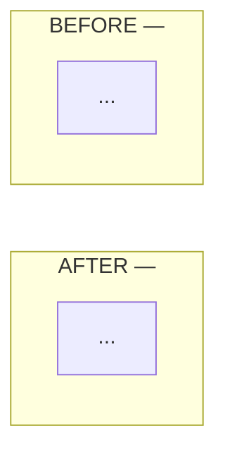

Open a reviewable PR/MR for the current branch. The reviewer arrives cold — not a teammate who lived through the work, but someone handed an agent's output. The body is the only bridge between the agent's context and what the human needs to decide.

**Multi-repo work is one PR per repo.** `cd` into each repo root before the create command — git CLIs infer the remote project from cwd, not from arguments. Cross-reference paired PRs in the body.

## Conventional commits

!`cat ~/.claude/skills/conventional-commits.md`

## CLI invocation

`--fill` conflicts with explicit title/body in both `gh` and `glab`.

| | Title | Body | Create | Cleanup flag |
|---|---|---|---|---|
| `gh` | `--title` | `--body` | `gh pr create` | `--delete-branch` |
| `glab` | `--title` | `--description` | `glab mr create` | `--remove-source-branch` |

Pass the cleanup flag so the source branch is removed on merge.

Updating an existing PR: `gh pr edit --body` / `glab mr update --description` take the new body and overwrite — re-render from current truth, don't fetch-and-concat.

## PR body

No placeholders, no filler — a `## Summary` with `[Description of changes]` is worse than no Summary at all.

- **Task** — issue link or one-line of what was asked.
- **Summary** — what + why. Approach chosen and why over alternatives: "X over Y because Z." 2–4 lines.
- **Focus** — one line right under Summary: the single place the reviewer's attention is most load-bearing. The 15-second "look here" pointer; detailed judgment calls live in Human Review.
- **Changes** — prefer inline diff annotations for per-hunk WHY. Body list *only* when the change spans many files/areas and the grouping itself aids navigation — a change list, not a file list. Else skip; don't restate the diff.
- **Self-Review** — `[x]` lines only, each naming its witness (test output, gate, diff hunk). Every claim must trace to the diff or pasted command output — an unsubstantiated "phantom" claim is worse than omitting it (sharply lowers merge rate, slows time-to-merge). Drop unchecked `[ ]`; "didn't verify" is noise — state the gap in Human Review.
- **Human Review** — specific things where human judgment is load-bearing.
- **Architecture** (when warranted, see below) — always the last section, after Human Review.

### Before/after diagram

When the PR reshapes data flow, control flow, ownership, or sync boundaries — anything where the reviewer has to hold "old shape" and "new shape" in their head to judge the diff — embed a before/after Mermaid as a `## Architecture` block at the **bottom of the PR body**, after `## Human Review`. Not in `## Summary` — the diagram is reference material reviewers scroll to, not the lede. GitLab and GitHub both render ```` ```mermaid ```` fences inline; no images, no Kroki.

**Stacked TB layout — BEFORE on top, AFTER below.** Outer `flowchart TB`, each subgraph `direction TB`, force ordering with an invisible `BEFORE ~~~ AFTER` link between the subgraph IDs themselves (not inner nodes — a node-level cross-subgraph edge collapses internal `direction TB` back to horizontal under the dagre renderer):

````

````

Side-by-side LR is unreliable on the dagre renderer GitLab/GitHub ship: any cross-subgraph edge (including the ordering hack) flips internal `direction TB` to horizontal. Stack instead.

Skip the diagram for pure refactors, bugfixes, dep bumps, copy changes — anything where the shape didn't move.

### Template

```
$(cat <<'EOF'
## Task

## Summary

**Focus:**

## Changes

<!-- Only for many-file spans where grouping aids navigation. Else annotate the diff inline and delete this section. -->
-

## Self-Review

- [x]

## Human Review

- [ ]

## Architecture

<!-- Only when the PR reshapes data/control flow. Otherwise delete this section. -->

EOF
)
```
