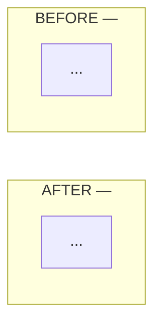

Open a reviewable PR/MR for the current branch. Reviewer arrives cold — the body is the only bridge between agent context and what the human needs to decide.

**Multi-repo work: one PR per repo.** `cd` into each repo root before the create command — git CLIs infer the remote from cwd, not arguments. Cross-reference paired PRs in the body.

## Conventional commits

!`cat ~/.claude/skills/conventional-commits.md`

## CLI invocation

`--fill` conflicts with explicit title/body in both `gh` and `glab`.

| | Title | Body | Create | Cleanup flag |
|---|---|---|---|---|
| `gh` | `--title` | `--body` | `gh pr create` | `--delete-branch` |
| `glab` | `--title` | `--description` | `glab mr create` | `--remove-source-branch` |

Pass the cleanup flag — source branch removed on merge.

Updating an existing PR: `gh pr edit --body` / `glab mr update --description` overwrite — re-render from current truth, don't fetch-and-concat.

## PR body

No placeholders, no filler — `## Summary` with `[Description of changes]` is worse than no Summary.

- **Task** — issue link or one-line of what was asked.
- **Summary** — what + why. Approach chosen and why over alternatives: "X over Y because Z." 2–4 lines.
- **Focus** — one line under Summary: the single place reviewer attention is most load-bearing. 15-second "look here" pointer; detailed judgment calls live in Human Review.
- **Changes** — prefer inline diff annotations for per-hunk WHY. Body list only when change spans many files/areas and grouping aids navigation — change list, not file list. Else skip; don't restate the diff.
- **Self-Review** — `[x]` lines only, each naming its witness (test output, gate, diff hunk). Every claim traces to diff or pasted command output — unsubstantiated "phantom" claim is worse than omitting it (lowers merge rate, slows time-to-merge). Drop unchecked `[ ]`; state gaps in Human Review instead.
- **Human Review** — specific things where human judgment is load-bearing.
- **Architecture** (when warranted, see below) — always last, after Human Review.

### Before/after diagram

PR reshapes data flow, control flow, ownership, or sync boundaries → embed a before/after Mermaid as `## Architecture` at the **bottom of the PR body**, after `## Human Review`. Not in `## Summary` — diagram is reference material, not lede. GitLab and GitHub both render ```` ```mermaid ```` fences inline; no images, no Kroki.

**Stacked TB layout — BEFORE on top, AFTER below.** Outer `flowchart TB`, each subgraph `direction TB`, force ordering with an invisible `BEFORE ~~~ AFTER` link between subgraph IDs (not inner nodes — node-level cross-subgraph edge collapses internal `direction TB` to horizontal under dagre):

````

````

Side-by-side LR unreliable on dagre: any cross-subgraph edge flips internal `direction TB` to horizontal. Stack instead.

Skip for pure refactors, bugfixes, dep bumps, copy changes — shape didn't move.

### Template

```
$(cat <<'EOF'
## Task

## Summary

**Focus:**

## Changes

<!-- Only for many-file spans where grouping aids navigation. Else annotate the diff inline and delete this section. -->
-

## Self-Review

- [x]

## Human Review

- [ ]

## Architecture

<!-- Only when the PR reshapes data/control flow. Otherwise delete this section. -->

EOF
)
```
