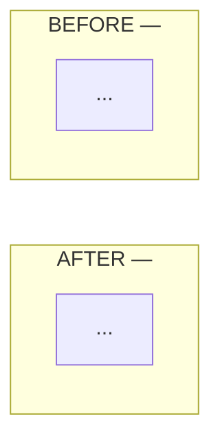

Open a reviewable PR/MR for the current branch. Reviewer arrives cold — the body is the only bridge between agent context and what the human needs to decide.

**Multi-repo work: one PR per repo.** `cd` into each repo root before the create command — git CLIs infer the remote from cwd, not arguments. Cross-reference paired PRs in the body.

## Preflight

Write the body from `git log --oneline <target>..HEAD` and `git diff <target>...HEAD`, never from memory of the session — what you remember doing and what the branch actually contains diverge.

Uncommitted work is not PR material unless the user explicitly said to include it. A branch that already has an open PR/MR gets updated, not duplicated. Push and set upstream before invoking the CLI — an unpushed branch drops `gh`/`glab` into an interactive prompt that cannot be answered here.

Title: conventional commit, same type/scope vocabulary as the commits it covers. Full spec if a case is unclear: `~/.claude/skills/conventional-commits.md`.

## CLI invocation

`--fill` conflicts with explicit title/body in both `gh` and `glab`.

| | Find existing | Title | Body | Create | Update body | Cleanup flag |
|---|---|---|---|---|---|---|
| `gh` | `gh pr view --json url` | `--title` | `--body` | `gh pr create` | `gh pr edit --body` | `--delete-branch` |
| `glab` | `glab mr view` | `--title` | `--description` | `glab mr create` | `glab mr update --description` | `--remove-source-branch` |

Pass the cleanup flag — source branch removed on merge.

Updating overwrites the body. Re-render from current truth; do not fetch-and-concat stale text.

Create as draft when the user asks, work is incomplete, verification is missing for risky changes, or the branch is clearly exploratory. Otherwise create ready for review.

## PR body

Default to a compact body. No placeholders, filler, unchecked boxes, or "chapters" that repeat the diff. Scale by reviewer load, not by fixed counts: small PRs should fit on one screen; large PRs may be longer when grouped by behavior, subsystem, or review path.

Required:
- **Summary** — what changed, why, and the most load-bearing reviewer focus point. For broad PRs, group bullets by behavior or subsystem; do not list files one-by-one.
- **Verification** — only witnessed checks or an explicit "Not run: <reason>".

Optional, only when needed:
- **Review notes** — specific judgment calls, residual risk, rollout concerns, or skipped verification.
- **Architecture** — keep the Mermaid diagram when data flow, control flow, ownership, or sync boundaries changed.

Do not include separate Task, Focus, Changes, Self-Review, and Human Review sections by default. Fold the useful parts into Summary, Verification, or Review notes. Prefer inline diff annotations for per-hunk WHY; use the body for context the diff cannot show.

### Architecture diagram

When warranted, place a before/after Mermaid diagram at the bottom of the body after any Review notes. Stack BEFORE above AFTER:

````

````

Skip for pure refactors, bugfixes, dep bumps, copy changes — shape didn't move.

## Report

After creating or updating, report the PR/MR URL, title, branch, ready/draft state, and verification gaps.
